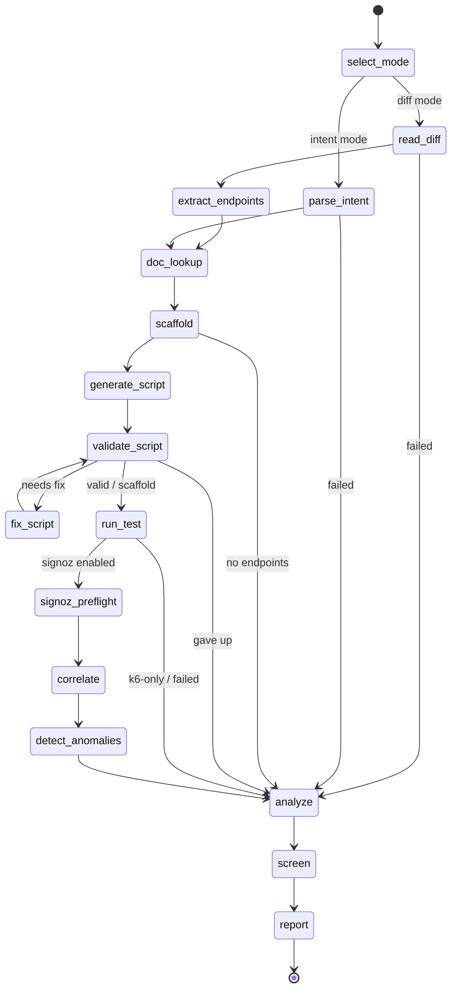

# omen

> Divines disaster, crafts the cure.

<p align="center">
  
  
  
</p>

**omen is an AI agent that load-tests a code change, finds the regression in live SigNoz traces, and
writes the fix, before it reaches production.** Point it at a git diff or a plain-language intent.
It drives real [k6](https://github.com/grafana/mcp-k6) load against the affected endpoints,
correlates the result with server-side telemetry through the official
[SigNoz MCP Server](https://signoz.io/docs/ai/signoz-mcp-server), names the root cause, and hands back a
validated remediation diff. For engineering and SRE teams who need to catch load-induced
regressions before a 2am page.

omen runs as an audited [Burr](https://github.com/apache/burr) state machine over MCP, served by
[Theodosia](https://msradam.github.io/theodosia/): the driving agent sees one tool, illegal steps
are refused, and every step and refusal lands on a hash-chained ledger. Named for Kassandra, who
foresaw what others would not believe; the workflow is themed as a tarot draw, one Major Arcana
card per phase (`omen arcana` lays out the spread).

Built for [Agents of SigNoz](https://www.wemakedevs.org/hackathons/signoz) (Track 01 · AI & Agent Observability). Setup: [`docs/SIGNOZ_SETUP.md`](docs/SIGNOZ_SETUP.md).

## What it does

- **Diff or intent driven.** Reads the changed endpoints from a git diff, or scores an OpenAPI spec against a plain-language intent.
- **Real load.** Generates and runs an actual k6 test through the Grafana k6 MCP server, on top of a deterministic scaffold so a run never fails for lack of a model.
- **Server-side truth from SigNoz.** Correlates the run with trace aggregates through the official SigNoz MCP Server (`signoz_aggregate_traces`, `signoz_search_traces`) over the test window. Catches latency degradations that produce zero errors and would slip past any threshold alert.
- **Root cause and a fix.** Writes a cited analysis and a validated remediation diff that applies cleanly, screened by an independent auditor model before the verdict is sealed.
- **Audited by construction.** A governed state machine refuses illegal steps; every step and refusal is on a hash-chained ledger that `omen verify` checks.
- **Hands-free guard.** `omen watch` runs the whole workflow when a commit changes an endpoint, catching the regression at commit time.
- **Model-agnostic.** The same loop (drive, write, audit) runs on Gemini, a local open model, or a frontier API, unchanged.
- **Self-observable.** Publishes its own state-machine walk as OTLP traces to SigNoz, so the agent is visible in the system it observes.

## Install

```bash
uv sync
```

omen drives k6 through the [Grafana k6 MCP server](https://github.com/grafana/mcp-k6) and reads
SigNoz through the [official SigNoz MCP server](https://signoz.io/docs/ai/signoz-mcp-server). Full
setup: [`docs/SIGNOZ_SETUP.md`](docs/SIGNOZ_SETUP.md).

```bash
foundryctl cast -f casting.yaml   # SigNoz + OTLP + MCP (see docs/SIGNOZ_SETUP.md)
cp .env.example .env              # set OMEN_SIGNOZ_API_KEY
uv run opentelemetry-bootstrap --action=install
```

```bash
brew install k6 && omen warm-k6   # install k6 2.0+; warms the extension cache on first use
# alternatives: standalone binary (OMEN_K6_CMD=mcp-k6) or Docker (OMEN_K6_DOCKER=1)
```

The SigNoz step is optional: without `OMEN_SIGNOZ_API_KEY`, omen
skips correlation and runs k6-only. Model backend: see [Configuration](#configuration).

## Quickstart

The fastest first success needs no SigNoz, k6, or model. It runs the whole state machine against
fakes:

```bash
uv run pytest        # the full workflow against Theodosia's FakeUpstream and a fake model
omen render         # print the state machine
omen arcana         # the tarot spread, one card per phase
```

For a full live run against a bundled demo app (starts the app under `opentelemetry-instrument`, drives real k6, queries live
SigNoz, writes the grounded analysis):

```bash
uv run python scripts/verify_scenario.py petclinic   # or storefront | feed | gateway | orders
```

For a recorded demo (terminal cast → GIF for README):

```bash
./scripts/record_demo_cast.sh   # asciinema + agg → docs/assets/omen-run.gif
./scripts/record_demo.sh        # X11 screen capture → docs/assets/omen-run.mp4
```

## Usage

Inspect and serve the workflow:

```bash
omen doctor --runtime     # validate the graph and runtime tool shape
omen render               # print the state machine
omen serve                # mount as an MCP server over stdio (both upstreams wired in)
```

Drive it locally, no cloud agent. `omen pilot` lets a local open model drive the FSM step by step:
it reads the reachable actions and calls `step` for each phase itself, doing the per-phase work as it
goes (the `screen` phase hands off to an independent auditor). Driver, writer, and auditor are all
the local model:

```bash
omen pilot --intent "load test the pet listing endpoint" \
  --repo-path examples/petstore --target-base-url http://localhost:8000 --signoz-service petclinic
# or diff mode: omen pilot --repo-path /path/to/repo --ref HEAD~1 --signoz-service petclinic
```

Run it in the background, triggered on diff detection. `omen watch` polls a repo's git HEAD and,
when a new commit changes an HTTP endpoint, drives the whole workflow in diff mode against that
change, then prints the verdict and a proposed fix and publishes the run to SigNoz over OTLP:

```bash
omen watch --repo-path /path/to/repo --target-base-url http://localhost:8000 --signoz-service petclinic
# one-shot for a post-commit hook or CI: omen watch --once --repo-path . --target-base-url ...
```

Or drive it from Claude Code (or any MCP client) by registering the server:

```bash
claude mcp add --scope=user --transport=stdio omen -- omen serve
```

Then ask the agent to run the workflow with the `step` tool, for example:
"Use the omen step tool. Load test the pet listing endpoint against
http://localhost:8000; the spec is under examples/petstore; correlate with SigNoz
service petclinic."

The entry inputs for `select_mode`:

- diff mode: `{"repo_path": "/path/to/repo", "ref": "HEAD~1", "target_base_url": "http://localhost:8000", "signoz_service": "petclinic"}`
- intent mode: `{"repo_path": "/path/with/openapi.json", "intent": "load test the checkout endpoint", "target_base_url": "...", "signoz_service": "petclinic"}`

Review recorded runs:

```bash
omen sessions ls
omen sessions show <app-id>
omen logs <app-id> --refusals
omen verify <app-id>        # confirm the ledger has not been tampered with
```

## Configuration

| Variable | Default | Purpose |
| --- | --- | --- |
| `OMEN_LLM` | `gemini` | model backend: `gemini` (Google GenAI SDK), `ollama` (local), `claude_agent`, or `anthropic` |
| `OMEN_MODEL` | `gemini-3.1-flash-lite` | model id for the selected backend |
| `GEMINI_API_KEY` | unset | Gemini API key (for `OMEN_LLM=gemini`) |
| `OLLAMA_HOST` | `http://localhost:11434` | Ollama endpoint (for `OMEN_LLM=ollama`) |
| `ANTHROPIC_API_KEY` | unset | Claude API key (for `OMEN_LLM=anthropic`) |
| `OMEN_K6_CMD` | `k6 x mcp` | command line for the k6 MCP server (set to `mcp-k6` for the standalone binary) |
| `OMEN_K6_DOCKER` | unset | if set, run the k6 MCP server via Docker |
| `OMEN_K6_IMAGE` | `grafana/mcp-k6:latest` | Docker image when `OMEN_K6_DOCKER` is set |
| `OMEN_SIGNOZ_URL` | `http://localhost:8080` | SigNoz API base URL |
| `OMEN_SIGNOZ_API_KEY` | unset | service-account API key (`SIGNOZ-API-KEY` header) |
| `OTEL_EXPORTER_OTLP_ENDPOINT` | unset | OTLP endpoint for omen + demo app traces (e.g. `http://localhost:4317`) |
| `OTEL_EXPORTER_OTLP_PROTOCOL` | `grpc` | OTLP transport |
| `THEODOSIA_HOME` | `~/.omen` | ledger / session store |

`omen serve` loads these from a `.env` in the project root if present (see
`.env.example`); real environment variables take precedence. Keep `.env` out of git
(it is git-ignored) since the token is a credential.

When running the k6 server in Docker with `OMEN_K6_DOCKER=1`, omen uses `--network host` so the
container can reach demo apps on `127.0.0.1:<port>`.

## How it works



(generated by `omen render --mermaid`)

- `doc_lookup` — consults the k6 MCP documentation tools and records version-grounded citations. Non-blocking; generation proceeds if the docs are unavailable.
- `scaffold` — composes a deterministic, self-contained k6 baseline from the OpenAPI schema (per-endpoint requests with sample bodies, baked base URL, load options). No model. This scaffold is the known-good fallback.
- `generate_script` — the model authors the final script on top of the scaffold, guided by k6's own `generate_script` MCP prompt and `best_practices` resource.
- `validate_script` — gates the script at `k6.validate_script`. Failures route to `fix_script`, which repairs the script from the real k6 error (stderr + the server's structured issues and suggestions) and loops back. Bounded by `MAX_FIX_ATTEMPTS`; gives up cleanly to the scaffold so an unvalidated script never reaches `run_test`.
- `run_test` — executes the validated script via `k6.run_script` and records the wall-clock test window.
- `signoz_preflight` — checks the target service exists in SigNoz (`signoz_list_services`) before correlating. Non-blocking.
- `correlate` — SigNoz MCP trace aggregates and searches synthesize client-vs-server findings: which route degraded and why.
- `detect_anomalies` — time-series p95 buckets from `signoz_aggregate_traces` flag latency breaches over the test window. Non-blocking.
- `analyze` — the writer model produces a grounded analysis (root cause, evidence with source citations, recommendation) and, in diff mode, a proposed remediation diff that applies cleanly. Both fall back to deterministic text when no model is available.
- `screen` — an independent auditor model checks every claim in the analysis against the cited telemetry. Non-blocking.
- `report` — assembles the combined client-plus-server verdict, seals it to the ledger, and publishes the run and the agent's state-machine walk to SigNoz over OTLP.

## The Major Arcana

Each phase is a card the agent turns. Run `omen arcana` for the full spread.

| Card | Phase | Omen |
| --- | --- | --- |
| The Fool (0) | `select_mode` | the querent sets out: diff or intent |
| The High Priestess (II) | `read_diff` | hidden knowledge read from the diff |
| The Emperor (IV) | `extract_endpoints` | order from change: the routes are named |
| The Empress (III) | `parse_intent` | intuition reads the intent into endpoints |
| The Hierophant (V) | `doc_lookup` | doctrine consulted: the k6 docs ground the rite |
| The Chariot (VII) | `scaffold` | the vehicle is assembled from the spec: a runnable scaffold takes shape |
| The Magician (I) | `generate_script` | as above, so below: the agent authors the script atop the scaffold |
| Justice (XI) | `validate_script` | the script is weighed; the unworthy is turned back |
| Temperance (XIV) | `fix_script` | the flawed draft is tempered against k6's judgment until it holds |
| The Tower (XVI) | `run_test` | load strikes the structure; what breaks is revealed |
| The Hermit (IX) | `signoz_preflight` | a lantern into SigNoz before the reading |
| The Lovers (VI) | `correlate` | client and server joined over one window |
| The Star (XVII) | `detect_anomalies` | the latency band is cast; where load breaches it is revealed |
| The Sun (XIX) | `analyze` | the reading is made plain: cause, evidence, and the cure laid bare |
| The Hanged Man (XII) | `screen` | seen again through another's eyes: the reading is judged grounded, or not |
| Judgement (XX) | `report` | the verdict is spoken and sealed to the ledger |
| The World (XXI) | the ledger | the cycle closes: an immutable, hash-chained record |
| The Devil (XV) | a refusal | you are bound: only the legal moves are permitted |

## Demo scenarios

`examples/` ships five target apps, each a healthy baseline plus one "new" endpoint with a
distinct load-induced failure. Each runs under `opentelemetry-instrument` and exports traces to SigNoz.

| App | New endpoint | Failure signature | What it exercises |
| --- | --- | --- | --- |
| `petclinic` | `POST /api/visits` | 5xx, constant, `database is locked` | correlation isolates the root-cause error |
| `storefront` | `POST /api/checkout` | latency, **0 errors** (N+1 over a shared connection) | server-side latency invisible to the client error rate |
| `feed` | `POST /api/events` | latency **rising over the run** (unbounded recompute) | `detect_anomalies` catches the trend |
| `gateway` | `GET /api/quote` | **4xx** 429 throttling (too-tight rate limit) | client-vs-server error split: "throttled, not broken" |
| `orders` | `POST /api/order` | latency **+ 504 mix** (downstream cascade) | dependency root cause, resilience recommendation |

```bash
uv run python scripts/verify_scenario.py petclinic   # or storefront | feed | gateway | orders
uv run python scripts/setup_dashboard.py             # SigNoz dashboard (official REST API)
```

## Development

```bash
uv run ruff format . && uv run ruff check .
uv run pytest
```

The tests use Theodosia's `FakeUpstream` for both MCP servers and a fake LLM, so
they run offline with no k6, SigNoz, Gemini, or network.

### Windows

- **Terminal encoding:** `omen` and `scripts/capture_run.py` reconfigure stdout to UTF-8 so the tarot sigil (`🂠`) does not crash default `cp1252` consoles. Windows Terminal is recommended; alternatively set `PYTHONIOENCODING=utf-8`.
- **k6:** prefer local k6 2.0+ (`OMEN_K6_CMD=k6 x mcp`) over `OMEN_K6_DOCKER=1` — Docker `--network host` cannot reach demo apps on `127.0.0.1` on Windows.
- **Config:** copy `.env.example` to `.env` (not `.env.txt`); `omen` loads `.env` only.

## License

Apache-2.0. omen builds on Theodosia (Apache-2.0), Burr (Apache-2.0), the official
Grafana k6 and SigNoz MCP servers, and the Google GenAI SDK for Gemini.

Tarot icon by [Eucalyp](https://thenounproject.com/Eucalyp/) from the Noun Project,
[CC BY 3.0](https://creativecommons.org/licenses/by/3.0/).
