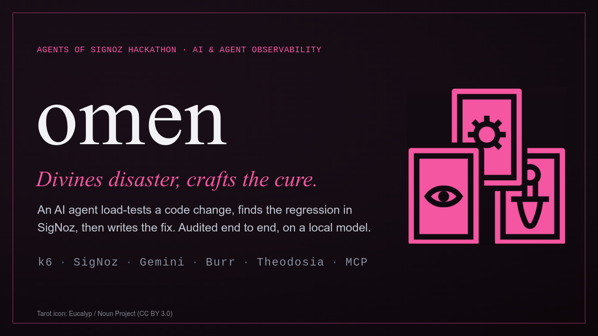
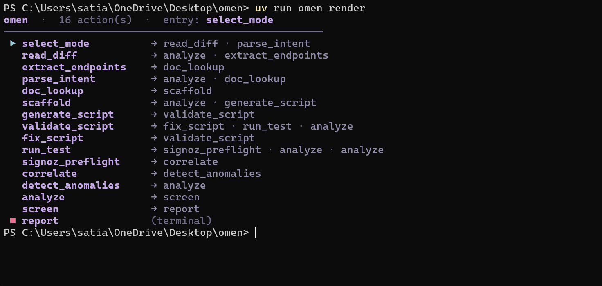
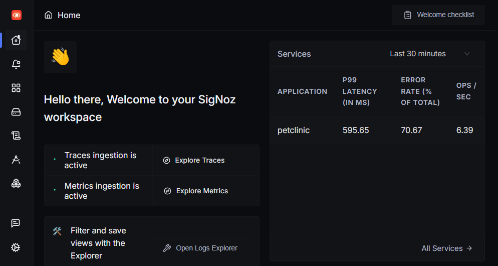
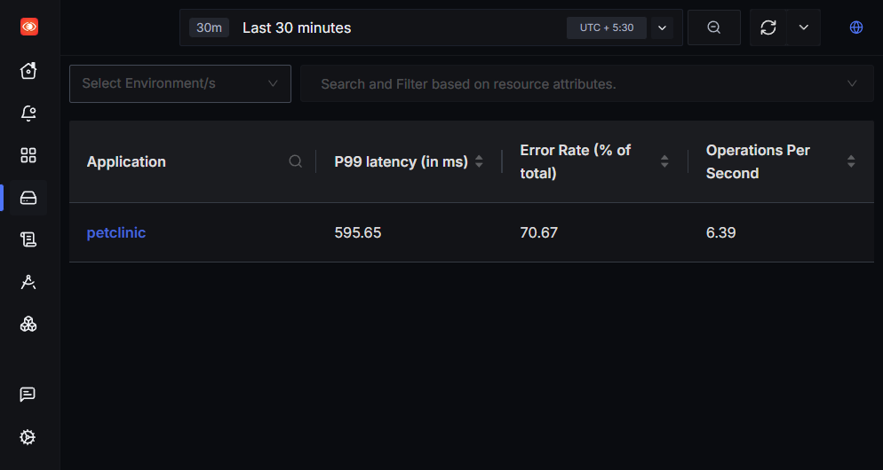
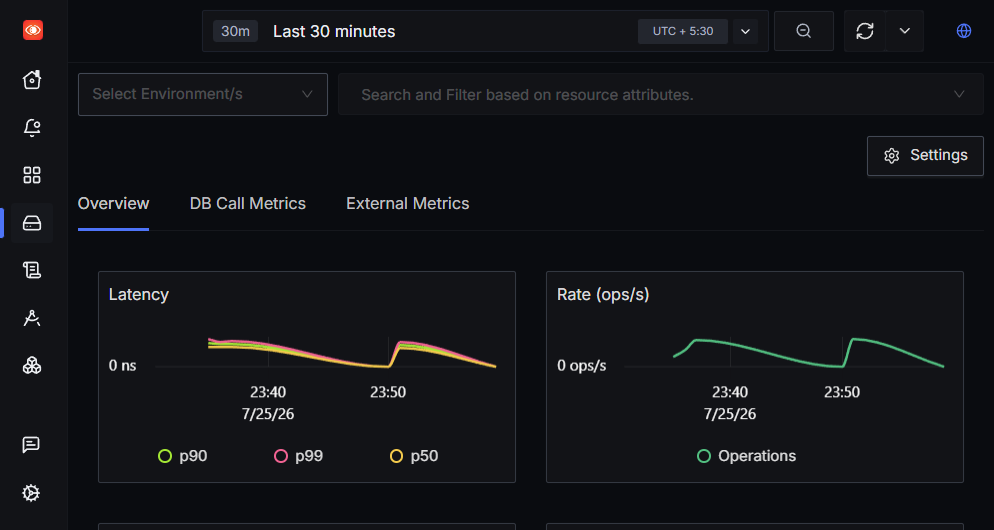
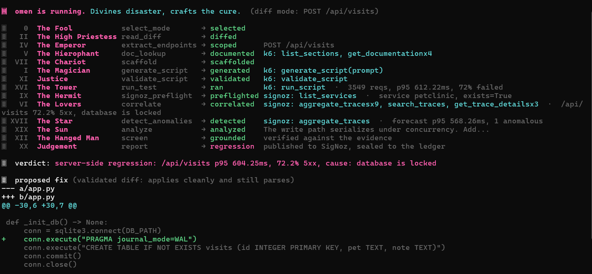

# My k6 run said 70% failed. SigNoz told me *why* — then my agent wrote the fix



I was staring at a load-test number that looked decisive: **~70% of requests failed**. Cool. Except that number alone is almost useless at 2am.

Was it my new endpoint? Rate limiting? A bad client script? A flaky network? Or a real server bug?

For [Agents of SigNoz](https://www.wemakedevs.org/hackathons/signoz), I built **omen** — an agent that load-tests a code change with k6, correlates the same window against live SigNoz traces, names the root cause, and hands back a remediation diff. This post is what I actually learned wiring that loop on Windows with Gemini, Foundry, and the official SigNoz MCP server.

Repo: [github.com/Satianurag/omen](https://github.com/Satianurag/omen)

---

## The problem I kept hitting

k6 is great at client-side truth: request count, p95, failure rate. It is terrible at answering “what broke *inside* the service?”

I planted a small FastAPI demo (`petclinic`) with a bad write path:

- `POST /api/visits`
- SQLite with `BEGIN IMMEDIATE`
- tiny timeout
- a fake sleep under lock

Under concurrent load it fails hard. Client-side you see 5xx. Server-side, SigNoz sees the real error string: **`database is locked`**.

That gap — client metrics vs server spans — is what omen exists for.

---

## What omen is (short version)

omen is a governed [Burr](https://github.com/apache/burr) state machine served over MCP by [Theodosia](https://msradam.github.io/theodosia/). The driver sees one tool: `step`. Illegal transitions get refused. Every step lands on a hash-chained ledger you can verify later.

Rough walk:

1. Read a git diff (or an intent)
2. Scaffold + generate a k6 script
3. Validate and run it through Grafana’s k6 MCP
4. Preflight the SigNoz service
5. Correlate traces (`signoz_aggregate_traces`, `signoz_search_traces`, `signoz_get_trace_details`)
6. Detect latency anomalies over the test window
7. Analyze → groundedness screen → report + remediation



*Figure: `omen render` — 16 actions, legal edges only. Note `signoz_preflight` after `run_test`.*

---

## How I used SigNoz (not “I used observability”)

### 1. Self-hosted via Foundry

I deployed SigNoz with Foundry from the repo’s `casting.yaml`:

```bash
foundryctl cast -f casting.yaml
```

That gave me:

| Piece | URL |
| --- | --- |
| UI | `http://localhost:8080` |
| OTLP gRPC | `http://localhost:4317` |
| SigNoz MCP | `http://localhost:8000/mcp` |

API key went into `.env` as `OMEN_SIGNOZ_API_KEY`. No inline comments on that line — that bit me once and silently broke auth.

### 2. Official OpenTelemetry on the target app

Demo apps run under stock `opentelemetry-instrument`. No custom shipper:

```powershell
$env:OTEL_SERVICE_NAME='petclinic'
$env:OTEL_EXPORTER_OTLP_ENDPOINT='http://localhost:4317'
$env:OTEL_EXPORTER_OTLP_PROTOCOL='grpc'
$env:OTEL_TRACES_EXPORTER='otlp'
uv run opentelemetry-instrument python examples/petclinic/app.py serve
```

After a few omen runs, the SigNoz home page stopped looking empty:



*Figure: Traces + metrics ingestion active. Services widget shows `petclinic` with ~70% error rate and ~596ms p99 over the last 30 minutes.*

That services row is the “something is on fire” view:



And the service overview shows the load spikes from the k6 runs as clear humps in rate and latency:



*Figure: Two load bursts on `petclinic` — same windows omen used for correlation.*

### 3. Correlation through the SigNoz MCP (not hand-clicked UI)

This was the interesting part for Track 01. omen does not scrape the UI. It talks to the official SigNoz MCP server during the run.

On a real petclinic run (Gemini backend, local k6 MCP, SigNoz correlate), the phase stream looked like this:



*Figure: Terminal output from a full omen run — cards for each phase, including SigNoz tools.*

The numbers from that run (not invented for this blog):

- k6: **3897 requests**, p95 **547.59ms**, **~72% failed**
- SigNoz preflight: `service petclinic, exists=True`
- Correlate: `aggregate_traces` ×9 + `search_traces` + `get_trace_details` ×3
- Worst path: `/api/visits` **72.1% 5xx**, top error **`database is locked`**
- Guardian screen: **grounded**
- Verdict: server-side regression on `/api/visits`

Client p95 (~548ms) and server-side p95 (~543ms) lined up. That consistency mattered to me — if those numbers diverged wildly, I’d distrust the join.

### 4. The agent publishes itself back into SigNoz

After `report`, omen emits `omen.run` and `omen.step.*` spans over OTLP (when `OTEL_EXPORTER_OTLP_ENDPOINT` is set). So the *agent walk* is visible in the same backend that observed the app. That self-observability loop is half the point of this track.

---

## The fix it proposed (and why it wasn’t hand-wavy)

omen didn’t stop at “SQLite is sad.” It returned a validated unified diff that:

- raised the connect timeout (`0.25` → `5.0`)
- enabled `PRAGMA journal_mode=WAL`
- removed `BEGIN IMMEDIATE`
- removed the artificial `time.sleep(0.015)` under the lock

That’s exactly the planted fault class. The Guardian check marked the analysis grounded against the cited telemetry before the verdict was sealed.

Also: every stepped phase went through Theodosia’s mounted MCP `step` tool, so the session wrote a real **`ledger.jsonl`**. `omen verify` came back HMAC-keyed and intact — important if you’re going to claim “audited by construction” in a demo.

---

## Gotchas I only learned by breaking things

These are the details that bit me on a fresh clone:

**Windows + Docker k6 is a trap.**  
`OMEN_K6_DOCKER=1` with `--network host` cannot reach `127.0.0.1` demo apps on Windows. Local `k6 x mcp` worked. Put `OMEN_K6_CMD=k6 x mcp` in `.env` and leave Docker k6 off.

**`uv run omen`, not bare `omen`.**  
After `uv sync`, the `omen` entrypoint lives in `.venv`. Use `uv run omen …` (or activate the venv). Same for pytest and scripts.

**`opentelemetry-bootstrap` needs pip in a uv venv.**  
`uv run opentelemetry-bootstrap --action=install` failed here with `No module named pip`. Fix with `uv run python -m ensurepip --upgrade`, or skip it — `uv sync` already installs FastAPI + OTLP packages the demos need.

**Runnable demos are on 8400–8404, not `:8000` / `petstore`.**  
`examples/petclinic` serves `http://localhost:8400`. `examples/petstore` is OpenAPI-only (unit tests). SigNoz MCP itself is on `:8000/mcp` — don’t confuse that with the app port.

**`omen pilot` ≠ Gemini by default (until I fixed it).**  
Phase workers already respected `OMEN_LLM=gemini`. The pilot *driver* still assumed Ollama/Granite. I fixed the non-Ollama path to walk the same mounted MCP server deterministically so Gemini runs still seal the ledger. Banner now says `Gemini is reading.` (honest: Burr/MCP walks the graph; Gemini authors the work inside phases).

**Bypassing `mount()` drops your ledger.**  
Calling `build_application().arun()` (what `verify_scenario.py` uses for a fast live check) can leave you with a thin or empty multi-step ledger listing. Driving through MCP `step` via `omen pilot` writes a real `ledger.jsonl` that `omen verify` can HMAC-check. Use verify_scenario to prove k6+SigNoz; use pilot when you need the audited session story.

**SigNoz API keys hate trailing comments.**  
`OMEN_SIGNOZ_API_KEY=.... # note` broke auth. Key alone on the line.

**Filename must be `.env`, not `.env.txt`.**  
Windows “Save as text” bit me once. omen only loads `.env`.

---

## What I’d tell myself on day one

1. Instrument the *target* first. If SigNoz Services doesn’t show your app with a nasty error rate after a load test, stop debugging the agent.
2. Correlate on a wall-clock window from the k6 run — not “last 1 hour of everything.”
3. Prefer MCP tools that return structured aggregates (`signoz_aggregate_traces`) before you drown in individual spans.
4. Keep the agent’s own walk on OTLP. Judges (and future-you) can see whether the FSM actually ran.
5. Demo a failure k6 alone can’t explain cleanly. `database is locked` from traces beats “high error rate” from a client report.
6. On Windows, never start from `OMEN_K6_DOCKER=1` — local k6 first.

---

## Try the same path

```powershell
cd omen
foundryctl cast -f casting.yaml
Copy-Item .env.example .env
# Edit .env: OMEN_SIGNOZ_API_KEY, GEMINI_API_KEY, OMEN_LLM=gemini, OMEN_K6_CMD=k6 x mcp
# Do NOT set OMEN_K6_DOCKER=1 on Windows
uv sync
uv run omen warm-k6
# optional (needs pip in the venv):
# uv run python -m ensurepip --upgrade
# uv run opentelemetry-bootstrap --action=install

# Fastest live proof (starts petclinic :8400 for you):
uv run python scripts/verify_scenario.py petclinic

# Audited pilot path (full ledger) — terminal 1:
$env:OTEL_SERVICE_NAME='petclinic'
$env:OTEL_EXPORTER_OTLP_ENDPOINT='http://localhost:4317'
$env:OTEL_EXPORTER_OTLP_PROTOCOL='grpc'
$env:OTEL_TRACES_EXPORTER='otlp'
uv run opentelemetry-instrument python examples/petclinic/app.py serve

# terminal 2 — intent mode (or --ref HEAD~1 against a two-commit demo repo)
uv run omen pilot `
  --intent "load test recording a new visit" `
  --repo-path examples/petclinic `
  --target-base-url http://127.0.0.1:8400 `
  --signoz-service petclinic

uv run omen sessions ls
uv run omen verify <app-id>
```

Open `http://localhost:8080` → Services → `petclinic`. If you see a fat error rate after the run, the loop is alive.

---

## Closing

I didn’t learn that “observability is important.” I learned that a 70% k6 failure rate is a *question*, and SigNoz traces are where the answer lives — especially when an agent can query those traces through MCP in the same window as the load test and come back with a grounded fix.

That’s omen. Divines disaster, crafts the cure — but only because SigNoz made the server side legible.

**Links**

- Project: [github.com/Satianurag/omen](https://github.com/Satianurag/omen)
- Hackathon: [Agents of SigNoz](https://www.wemakedevs.org/hackathons/signoz)
- SigNoz MCP docs: [signoz.io/docs/ai/signoz-mcp-server](https://signoz.io/docs/ai/signoz-mcp-server)
- Blog guide I followed: [WeMakeDevs Blog Guide](https://www.wemakedevs.org/hackathons/signoz/blog-guide)
